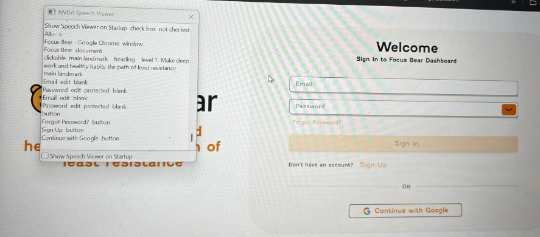
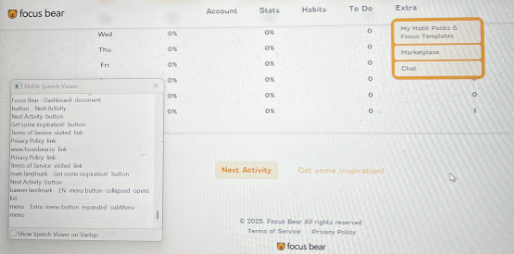
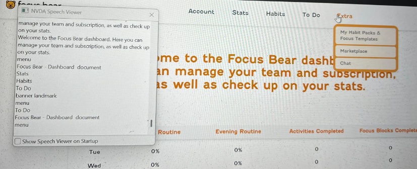

# 🎨 How to Test Accessibility

## Role Context

Manual Q&A Intern at Focus Bear.  
Many Focus Bear users have ADHD, Autism, or other cognitive and physical challenges. My role includes ensuring the app remains accessible and usable for all, following WCAG standards and accessibility best practices.

---

## 🔍 Research & Learn

### WCAG Overview

- **Definition**: WCAG (Web Content Accessibility Guidelines) is the global standard for making digital content accessible to people with disabilities.
- **Four Key Principles (POUR)**:
  1. **Perceivable** – Information and UI must be presented in ways users can perceive.
  2. **Operable** – Navigation and controls must be usable by all.
  3. **Understandable** – Information and operation must be clear and predictable.
  4. **Robust** – Content must work well with assistive technologies.

### Screen Readers & Testing

- **Examples**:
  - NVDA (Windows)
  - VoiceOver (macOS/iOS)
  - TalkBack (Android)
- **Testing Approach**:
  - Navigate through Focus Bear without looking at the screen.
  - Verify that all elements have descriptive labels and reading order is logical.
  - Ensure interactive elements are clearly announced (buttons, links, toggles).

### Common Accessibility Issues

- Missing or incorrect `alt` text on images.
- Low contrast between text and background.
- Poor focus visibility.
- Inconsistent or illogical tab order.
- Elements not reachable via keyboard.
- Complex layouts without clear headings.

### Keyboard Navigation & Focus Management

- Check that all interactive elements can be reached using `Tab` and activated with `Enter` or `Space`.
- Verify focus indicators are visible and move logically.
- Test for "keyboard traps" (where focus gets stuck).

### Accessibility Testing Tools

- **Automated Checks**: Lighthouse, Axe DevTools, WAVE.
- **Manual Verification**: Screen readers, keyboard navigation, contrast checkers.

---

## 📝 Reflection

### How I Would Test Focus Bear with a Screen Reader

- Enable NVDA or VoiceOver and navigate through the app entirely by keyboard or swipe gestures.
- Check that each element is announced correctly with descriptive text.
- Confirm reading order follows the intended visual flow.
- Validate that all essential features are usable without relying on sight.

### Accessibility Barriers for ADHD or Autism Users

- Overly cluttered UI or distracting animations.
- Inconsistent navigation patterns.
- Lack of clear instructions or feedback after actions.
- Complex forms without progressive disclosure.

### Advocating for Fixing Accessibility Issues

If a developer says, _"this doesn't impact most users"_, I would:

- Explain that accessibility improvements benefit **all** users, not just those with disabilities.
- Highlight legal and ethical obligations to follow WCAG.
- Share examples of how accessibility improvements improve usability for a broader audience.
- Emphasize Focus Bear’s mission to support neurodivergent individuals.

## Hands-On NVDA Testing – Login Screen

I tested the **Focus Bear login screen** using NVDA with Speech Viewer enabled.

- NVDA correctly announced the **Email** input as _“Email edit blank”_.
- The **Password** input was read as _“Password edit protected blank”_, confirming the field is secure.
- Buttons such as _“Forgot Password?”_, _“Sign Up”_, and _“Continue with Google”_ were announced accurately with their roles.

This shows that the login page has good accessibility support, as all fields and buttons were clearly identified by NVDA without confusion.

## Hands-On NVDA Testing – Dashboard and Extras Menu

I tested the **Focus Bear dashboard and Extras menu** with NVDA.

- Buttons such as _“Next Activity”_ and _“Get some inspiration!”_ were announced clearly with their roles.
- Footer links like _“Terms of Service”_ and _“Privacy Policy”_ were correctly read as links.
- The **Extras menu** was announced as _“Extras menu button collapsed”_ and then _“Extras menu button expanded submenu”_ when opened, with submenu items (_My Habit Packs & Focus Templates, Marketplace, Chat_) read in order.

This confirms that the menu interaction provides appropriate feedback for screen reader users, and the navigation is smooth without confusion.

## Accessibility Issue – Extras Menu Announcement

When testing the **Extras menu** with NVDA, I noticed that it is announced only as _“menu”_ rather than _“Extras menu expanded”_. This lack of context could confuse screen reader users, as they may not know which menu they have opened.

**Expected Behavior:**  
NVDA should announce the menu with its label, e.g., _“Extras menu expanded submenu”_, and then read the items in order.

**Actual Behavior:**  
NVDA only says _“menu”_ and repeats _“Dashboard document”_, without properly announcing the context.

**Impact:**  
Users relying on screen readers may have difficulty identifying which navigation menu they are currently interacting with.

## 🧑‍💻 Personal Story – Keyboard Navigation Testing in Focus Bear

While testing **Focus Bear** with only my keyboard and NVDA enabled, I started on the **login screen**. Using the `Tab` key, I was able to move in a logical order: **Email → Password → Forgot Password? → Sign In → Sign Up → Continue with Google**. Each element had a visible focus outline, and NVDA announced them correctly. This showed that the login page has good keyboard accessibility.

On the **dashboard**, I tabbed through the top navigation (**Account, Stats, Habits, To Do, Extras**). The navigation worked smoothly until I reached the **Extras dropdown**. Here I noticed a small accessibility gap:

- When I pressed `Enter` on **Extras**, NVDA only announced _“menu”_ instead of _“Extras menu expanded”_.
- The submenu items (**My Habit Packs & Focus Templates, Marketplace, Chat**) could still be reached by pressing `Tab`, but the lack of clear announcement meant I wasn’t sure which menu I had opened.

This wasn’t a full **keyboard trap** (since I could continue tabbing), but it did reduce clarity for screen reader users.

I documented this issue in my QA notes using the format: **Steps to Reproduce → Expected Result → Actual Result → Impact**. My recommendation to the development team was to add an **ARIA label** (e.g., `aria-label="Extras"`) so NVDA would announce _“Extras menu expanded submenu”_.

This experience highlighted the importance of not only checking whether navigation is possible with `Tab`, but also whether the **context is correctly announced**. For Focus Bear’s mission to support neurodivergent users, these small improvements can make the interface far more inclusive and user-friendly.
