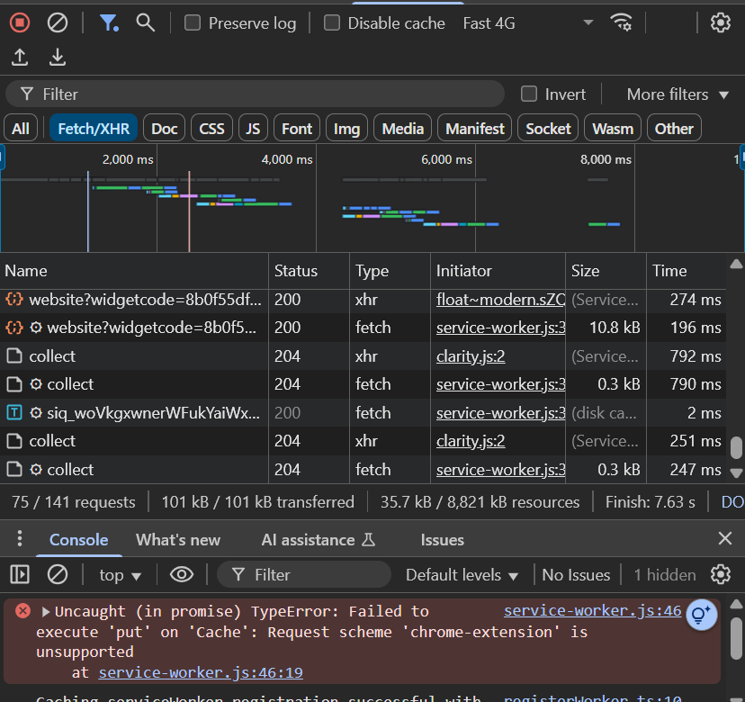
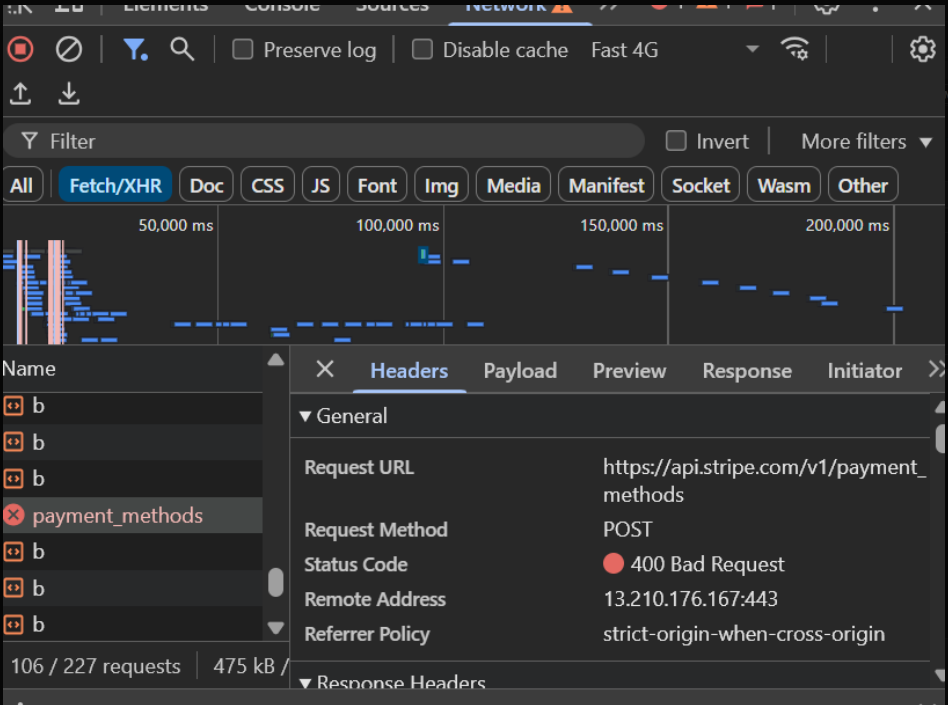

# 🔍 Understanding Logs & Debugging Tools for QA

## Role Context

Manual Q&A Intern at Focus Bear.  
My role requires me to identify and report issues accurately. Using logs and debugging tools allows me to provide developers with the detailed technical information they need to diagnose and fix problems quickly.

---

## 🔍 Research & Learn

### What Are Logs?

- **Definition**: Logs are records generated by an application, system, or server that document events, errors, and state changes.
- **Purpose in Debugging**: They help identify when, where, and why something went wrong in the app.

### Capturing Logs from a Web App (Browser DevTools)

- **Steps**:
  1. Open Chrome/Edge DevTools (`F12` or right-click → _Inspect_).
  2. Use the **Console** tab to view error/warning messages.
  3. Use the **Network** tab to monitor API calls, responses, and failures.
  4. Filter for `XHR`/`Fetch` requests to see API traffic.
  5. Right-click logs → _Save as_ to export them for sharing.

### Capturing Logs from a Mobile App

- **Android**: Use `adb logcat` (via Android Studio or command line) to capture device logs.
- **iOS**: Use Xcode’s device logs or Console app on macOS.
- Focus on crash reports, network errors, and debug prints relevant to the issue.

### Common Error Messages & Log Patterns

- `404 Not Found`: API endpoint doesn’t exist or incorrect path.
- `500 Internal Server Error`: Server issue processing the request.
- `401 Unauthorized`: Missing or invalid authentication token.
- Timeout errors: Network or API delays.
- Null reference exceptions or uncaught promise rejections in JavaScript.

### Using Network Requests to Diagnose API Failures

- Check **status codes** and **response bodies**.
- Look for **error messages** in API JSON responses.
- Verify the **request payload** is correct.
- Compare successful vs. failing requests for differences.

---

## 📝 Reflection

### If Focus Bear Crashes on a User’s Device but Not Mine

- Ask for user/device details (OS, app version, network type).
- Replicate the same conditions locally.
- Review mobile device logs (`logcat` or Xcode logs) to identify crash stack traces.
- Compare with my local logs to spot differences.

### Useful Log Messages for Bug Reports

- Timestamp of error occurrence.
- Full error message or stack trace.
- Related API call details (endpoint, payload, status code).
- Environment details (OS, browser/app version).

### Analyzing Unexpected API Responses

1. Check the **Network tab** in DevTools for request/response.
2. Confirm that the request payload is correct and complete.
3. Compare with API documentation or expected schema.
4. Share the API endpoint, status code, and response body with developers.

Reflection with My Own Examples

Example 1 – Console Error in Browser DevTools

While testing the Focus Bear dashboard, I opened the Console tab in Chrome DevTools. I observed a JavaScript error in red:

This error shows an uncaught promise rejection. Sharing this kind of log helps developers quickly trace the issue in the frontend code.

Example 2 – Network Request Failure (400 Bad Request)

Next, I switched to the Network tab in DevTools and monitored API calls. I captured a failed request to Stripe’s payment API:

Here, the status code 400 (Bad Request) indicates an invalid payload or missing parameter. This is exactly the kind of detail developers need when debugging API issues.

📖 Personal Experience – Debugging in My Facebook Privacy Awareness App Project

During my university project, I worked on developing a Facebook Privacy Awareness mobile app using Flutter and Firebase. While testing, I faced an issue where some privacy tutorial videos were not loading properly.

To debug:

I opened Browser DevTools while testing the web version and noticed a 404 Not Found error in the Network tab, which showed that the video file was being requested from the wrong path.

In the Console tab, I also saw JavaScript warnings pointing to missing resources.

By capturing these logs and sharing them with my teammates, we quickly identified that the file path in Firebase Storage was misconfigured. After correcting the URL, the videos loaded successfully.

This experience showed me how logs and debugging tools directly helped me solve real issues. It also built my confidence in using the same techniques during my internship to give developers detailed and actionable feedback.
