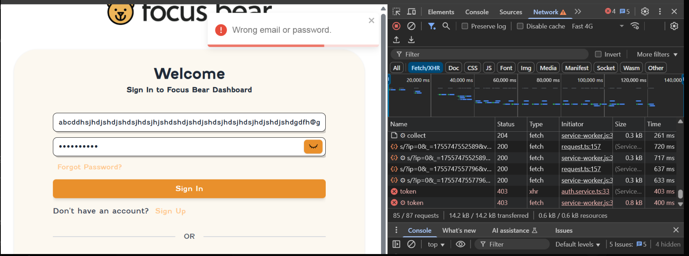
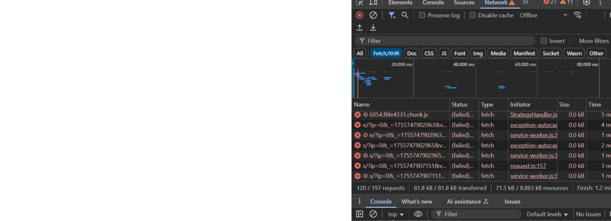

# 💥 Testing Error Handling & Edge Cases

## Role Context

Manual Q&A Intern at Focus Bear.  
In my role, I need to ensure that Focus Bear works reliably not only in normal use but also under unusual, extreme, or unexpected conditions.

---

## 🔍 Research & Learn

### Boundary Value Analysis

- **Definition**: A testing technique that focuses on values at the edges of input ranges (e.g., minimum, maximum, just inside/outside limits).
- **Usefulness**: Helps detect defects that occur at the “boundaries” where developers may not have accounted for edge conditions.

### Common Edge Cases for QA

- **Forms**: Empty inputs, excessively long text, invalid formats (e.g., wrong email syntax), special characters/emojis.
- **Authentication**: Wrong passwords, expired links, multiple failed login attempts.
- **App Flows**: Skipping steps, back button behavior, simultaneous actions.

### Testing Network Failures

- Simulate offline mode by disabling Wi-Fi/data mid-action.
- Test on slow connections using network throttling tools.
- Check if the app retries gracefully or shows meaningful error messages.

### Unexpected Input & Invalid Data

- Inputting symbols, SQL keywords, or unusual characters.
- Pasting large amounts of data into fields.
- Providing unsupported file formats.

### Testing Error Messages

- Ensure messages are **clear**, **specific**, and **user-friendly**.
- Avoid technical jargon—messages should guide the user on how to fix the issue.
- Consistency in style, tone, and placement.

---

## 📝 Reflection

### Edge Cases That Could Break Focus Bear’s Onboarding Flow

- Entering an extremely long name or email.
- Skipping required steps by navigating backwards or closing the app.
- Attempting to sign up with an already registered email.
- Poor internet connection during the onboarding tutorial.

### Expected Behavior if the App Fails Midway Through a Critical Action

- Save progress so the user can resume later.
- Display a clear message explaining what happened and how to proceed.
- Avoid data loss—store locally until the action can be retried.

### Testing for Network Instability

- Toggle network on/off during key actions (e.g., sign-up, habit creation).
- Use 3G/slow network simulation to check if UI remains responsive.
- Ensure actions either retry automatically or prompt the user to retry manually.

## 🧪 Edge-Case Test – Overlong / Invalid Email with Auth Failure

**Scenario:** Attempted login with an excessively long, invalid email string.

**Steps:**

1. Opened the Focus Bear login page.
2. Pasted an email with 80+ random characters before `@gmail.com`.
3. Entered a valid-looking password.
4. Clicked **Sign In**.

**Expected:**

- Email field rejects invalid format before sending request.
- Clear inline message like _“Please enter a valid email address (max 80 chars)”_.
- No backend authentication call triggered.

**Actual (Captured Evidence):**

- UI displayed a generic error: **“Wrong email or password”**.
- DevTools **Network tab** shows two failed `token` requests (HTTP **403 Forbidden**).
- Request was sent to backend despite invalid email format.

**Screenshot Evidence:**

– red error message shown in UI.
– DevTools showing 403 failures for `/token`.

**Notes:**

- Error message is misleading (suggests wrong credentials instead of invalid format).
- Could be improved by **front-end validation** (block bad input before hitting backend).
- Helps reduce unnecessary load on authentication service.

## 🔴 Failure Case – Network/Resource Loading Errors

**Scenario:** Tested app behavior with unstable or offline network conditions.

**Steps:**

1. Opened Focus Bear dashboard in Chrome.
2. Switched Network mode in DevTools to **Offline** (simulate poor connectivity).
3. Refreshed page and attempted to sign in.

**Expected:**

- App should display a **clear offline message** (e.g., _“No internet connection, please reconnect”_).
- Requests should be queued or retried once connection is restored.

**Actual (Captured Evidence):**

- Multiple requests failed (`chunk.js`, `service-worker.js`, `request.ts`).
- Status shown as **(failed)** in DevTools Network tab.
- No meaningful feedback was shown to the user — only silent failures in console.

**Screenshot Evidence:**

– DevTools showing repeated `(failed)` fetch attempts under offline mode.

**Notes:**

- User experience could be improved by **offline detection and a fallback screen**.
- This would prevent confusion when network instability occurs.
