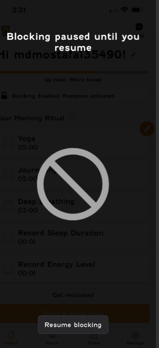

# 🐛 Reporting & Tracking Issues Effectively – Replicating Bugs Reported by Customers

## Role Context

Manual Q&A Intern at Focus Bear.  
Part of my work involves investigating bugs reported by real users, which often requires reproducing complex issues that occur in varied environments.

---

## 🔍 Research & Learn

### Steps QA Should Take for Hard-to-Reproduce Customer Bugs

1. **Review the report**: Gather all details from the initial ticket, including error messages, screenshots, and device/environment info.
2. **Reproduce under similar conditions**: Match the customer’s environment (OS, browser, app version, settings).
3. **Attempt different scenarios**: Test with variations in data, timing, network connectivity, and account state.
4. **Check existing logs**: Review backend and client logs for errors tied to the reported time.
5. **Request more info if needed**: Ask for steps, exact timestamps, media evidence.
6. **Escalate to developers**: If still unreproducible, recommend adding more logging or diagnostics.

---

### Information QA Should Request from Customer Support

- Exact steps taken before the issue occurred.
- Date/time of occurrence (including time zone).
- Device type, OS version, browser or app version.
- Any error messages or codes displayed.
- Screenshots or screen recordings.
- Frequency of the issue (one-time or recurring).

---

### How Logs, Screenshots, and Error Messages Help

- **Logs** reveal system events, API failures, and backend processing details.
- **Screenshots** show the state of the UI at the moment of the bug.
- **Error messages** can point to specific failing components or operations.

---

### When to Recommend Adding More Logging

- When critical details (e.g., API response codes, specific triggers) are missing from current logs.
- For intermittent or environment-specific bugs that cannot be replicated in staging.
- When multiple reports have a similar pattern but lack technical evidence.
- Logs that could help:
  - User action traces.
  - API request/response payloads.
  - Detailed error stack traces.
  - Performance metrics at the time of the event.

---

### How Other Teams Handle "Cannot Reproduce" Bugs

- Tag the issue as `Cannot Reproduce` but keep it open for monitoring.
- Add targeted logging in the suspected area of the code.
- Create automated monitoring or alerts for error patterns.
- Maintain a "watchlist" for recurring but unreproducible issues.

---

## 📝 Reflection

### If a Customer Reports a Crash but I Can’t Reproduce It

1. Verify app version, OS, and environment details match my test setup.
2. Attempt reproduction in similar conditions and variations.
3. Review error logs around the reported time.
4. Request additional evidence from customer support.
5. Escalate to the developer team for further diagnostics if still unresolved.

### When to Ask Developers to Add More Logging & What Kind Helps

- Ask for more logging when key reproduction details are missing, especially in suspected problem areas.
- Logs should include:
  - Step-by-step user interaction tracking.
  - Error codes and messages from API calls.
  - Device state information (memory, connectivity).

### Common Patterns in Bugs That Only Occur for Some Users

- Device-specific issues (older OS versions, hardware limitations).
- Account configuration differences.
- Race conditions or timing-sensitive workflows.
- Network connectivity issues.
- Data-dependent errors (e.g., special characters in input).

### 🐞 Personal Example – Investigating a Blocking Bug in Focus Bear

Recently, while testing the **Focus Bear app**, I noticed that when I paused blocking, I couldn’t access other parts of the app (**screenshot attached**). At first, I thought it was a bug, but I couldn’t be sure if it was intentional behavior or a defect.

To investigate, I:

1. Tried reproducing it on both **iOS** and **Windows** versions.
2. Compared results across multiple **accounts**.
3. Checked **console logs** for any error messages — none appeared.

Since I couldn’t confirm the intent, I documented it as a **potential UX bug** and would ask the developers to clarify expected behavior. If this was unintended, I would recommend **adding more logging** when blocking is paused, to capture whether navigation attempts are being blocked by code.
