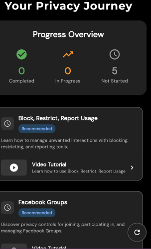
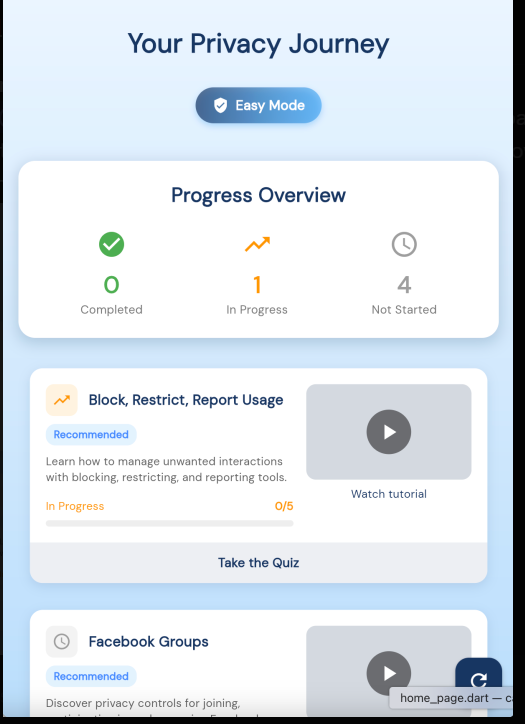

# 🏆 Working in a Scrum Team – Deployment & Hotfix Testing

## Role Context

Manual Q&A Intern at Focus Bear.  
My role includes testing before and after releases, verifying urgent hotfixes, and ensuring that production remains stable for users.

---

## 🔍 Research & Learn

### Difference Between a Scheduled Release, Rollback, and Hotfix

- **Scheduled Release**: A planned deployment of new features, fixes, or improvements on a set timeline.
- **Rollback**: Reverting to a previous stable version when a release causes significant issues.
- **Hotfix**: An urgent fix applied directly to production to resolve critical issues, often outside the regular release schedule.

### What QA Should Test Immediately After Deployment

- Core functionality (smoke tests) to confirm critical paths work as expected.
- New features to ensure they behave correctly in production.
- High-risk areas that could be affected by the recent changes.
- System performance and error logs for unexpected behavior.

### How QA Handles Hotfix Testing

- **Reproduce** the reported issue to confirm it exists.
- Test the hotfix in a staging/pre-production environment if possible.
- Verify that the fix resolves the issue without breaking related functionality (targeted regression testing).
- Perform sanity checks in production after deployment.

### Strategies to Prevent New Bugs in Urgent Fixes

- Keep the scope of the hotfix minimal—fix only the critical issue.
- Use automated regression tests where possible to speed up verification.
- Have peer reviews or pair testing for hotfix validation.
- Maintain clear documentation of what changed and why.

### How Other Teams Approach Post-Release Monitoring

- Set up monitoring dashboards and alerts for errors and performance metrics.
- Review crash/error logs frequently in the first hours after deployment.
- Keep a rollback plan ready in case a quick reversal is needed.

---

## 📝 Reflection

### If a Release Goes Live and Users Immediately Report Issues

1. Acknowledge and log the reports quickly.
2. Attempt to reproduce the issue in production or staging.
3. Communicate the severity and scope to the development team and Product Manager.
4. Decide whether to hotfix, rollback, or schedule a patch.

### Best Way to Prioritize Testing During a Hotfix

- Focus on **the affected area first** to confirm the bug is fixed.
- Then test **critical connected features** that could be impacted.
- Keep non-essential tests for after the fix is stable.

### How QA Can Ensure Stability While Allowing Fast Bug Fixes

- Have a **hotfix testing checklist** ready for urgent scenarios.
- Always perform at least minimal regression testing before approving deployment.
- Work closely with developers to clarify changes and risks.
- Use monitoring tools post-release to catch any issues early.

### Personal Example from Onboarding

During my onboarding, I observed a small post-release issue where a new **privacy quiz module** was deployed.  
Some users reported that the **progress tracker wasn’t updating** correctly after finishing the first quiz.

As QA, I first tried to **reproduce the bug** on my own device, confirmed it was happening, and logged the issue with clear reproduction steps and a screenshot.  
The developers created a quick hotfix, which I tested in staging before it was deployed to production.

Once deployed, I re-tested the fix in production to make sure the tracker updated correctly and also ran a quick **smoke test on related modules** to ensure nothing else broke.  
This experience taught me the importance of **fast communication** and **minimal but focused regression testing** during hotfixes.

### Personal Example – Hotfix Testing

I tested a bug where the **quiz progress bar was not updating** on iOS.

- **Before Hotfix (Bug):**  
  

- **After Hotfix (Fixed):**  
  

This showed me the importance of verifying the fix and running quick smoke tests to ensure related functionality remained stable.
