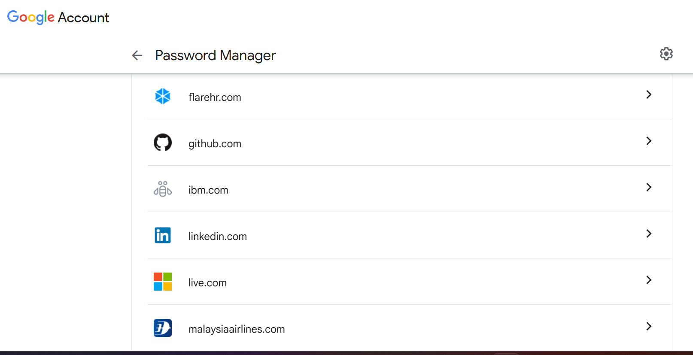
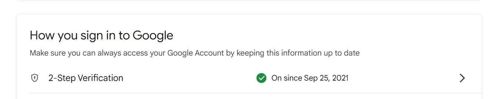
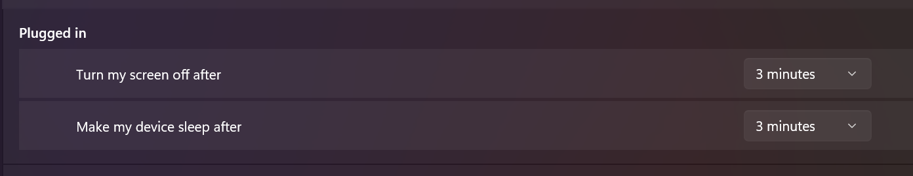

## 🔍 Research & Learn

### Common cyber security threats in a remote work environment

- **Phishing emails** targeting login credentials.
- **Malware** from unsafe downloads.
- **Weak passwords** leading to account compromise.
- **Unsecured Wi-Fi** exposing traffic to interception.
- **Device theft** leading to data loss.

### Best practices for keeping devices and accounts secure

- Use **strong, unique passwords** for each account.
- Enable **two-factor authentication (2FA)** wherever possible.
- Keep operating systems and software up to date.
- Avoid public Wi-Fi or use a VPN.
- Lock devices when unattended.

### Importance of locking your computer

- Prevents unauthorized access to company accounts, files, and systems.
- Reduces risk if you step away from your desk, even briefly.

### Handling phishing attempts and suspicious links

- Do not click suspicious links or download unexpected attachments.
- Verify sender email addresses before responding.
- Report phishing attempts to the IT/security team immediately.

### What makes a strong password & why use a password manager

- At least 12 characters, mix of upper/lowercase, numbers, and symbols.
- Avoid dictionary words or personal info.
- Password managers help generate and securely store complex passwords, reducing reuse.

### Importance of 2FA

- Adds an extra verification step beyond the password.
- Helps prevent account compromise even if the password is stolen.
- Should be enabled on all work and personal accounts that contain sensitive data.

---

## 📝 Reflection

### Security measures I currently follow & areas for improvement

- **Currently follow:** Strong passwords, regular software updates, cautious email behaviour.
- **Need to improve:** Consistent use of a password manager for all accounts and enabling 2FA everywhere possible.

### Making secure behaviour a habit

- Turn on automatic device lock after a short period of inactivity.
- Regularly audit account security settings.
- Treat every unknown link or file with suspicion.

### Steps to ensure password and account security

- Use a password manager to generate and store unique passwords.
- Enable 2FA on all Focus Bear accounts and related tools.
- Avoid password reuse across different accounts.

### Actions if I suspect a security breach

- Immediately change the affected account password.
- Notify the IT/security team.
- Review recent account activity for any unauthorized actions.
- Scan the device for malware.

---

## 🛠️ Task Completed

- All work accounts now use strong, unique passwords stored in a password manager.
- 2FA enabled on all Focus Bear-related accounts.
- Devices set to automatically lock after 2 minutes of inactivity.

**New Cyber Security Habit:**

> I will perform a monthly review of my account security settings to ensure passwords remain strong, 2FA is active, and unused accounts are deactivated.

## Phishing Alert Story – Norton Security Email

Last month, I received an email claiming I had purchased **Norton Security** and attached a bill.  
Since I hadn’t made any purchase, I treated it as a **suspected phishing attempt**.

### Steps I Took:

- ❌ I **did not click** any links or open attachments.
- 🔍 I **verified independently** by checking:
  - My **bank account** → no charges found.
  - My **Norton account via the official website** → no purchase recorded.
- 🚫 I used my email client’s **Report as Spam/Phishing** option.
- 🗑️ I then **deleted the email**.

