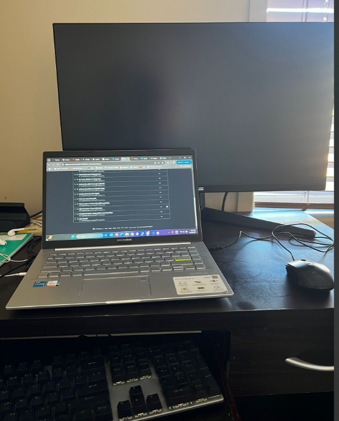

# 🏢 Occupational Health & Safety (OHS) for Desk-Based Work – Reflection

## Role Context

Manual Q&A Intern at Focus Bear.  
My work often involves long periods of laptop use for testing, documentation, and reporting. This makes it essential to have a safe and ergonomic workspace to avoid strain and maintain productivity.

---

## Reflection

### Risks of Using a Laptop Without External Equipment

- **Neck strain** from looking down at a low screen.
- **Wrist discomfort** from typing on a flat keyboard.
- **Poor posture** leading to back and shoulder pain.
- **Eye strain** from prolonged close-up screen focus.

---

### Equipment Changes I Can Make

- Use a **laptop stand** to raise the screen to eye level.
- Add an **external keyboard and mouse** to allow better arm and wrist positioning.
- Use an **ergonomic chair** with lumbar support to maintain a healthy spine posture.

---

### Behavioural Changes to Improve Posture and Reduce Strain

- Sit upright with feet flat on the floor and knees at a 90° angle.
- Adjust monitor height so the top of the screen is at or slightly below eye level.
- Take short movement breaks every 30–45 minutes to stretch and reset posture.
- Follow the **20-20-20 rule** to reduce eye strain: every 20 minutes, look at something 20 feet away for 20 seconds.

---

### How I Will Remind Myself

- Use Focus Bear’s **movement break reminders** to stand up, stretch, or walk.
- Set phone or desktop posture alerts.
- Keep a sticky note near my desk as a visual reminder to “Check Posture.”

---

## 🛠️ Task Responses

**1. Adjust your laptop setup based on ergonomic best practices**  
I placed my laptop on a stand to bring the screen to eye level and connected an external keyboard and mouse to improve typing posture.

**2. Identify at least one piece of equipment that could improve your posture and comfort**  
A laptop stand significantly improved my screen height and reduced neck strain. An ergonomic chair is my next planned upgrade.

**3. Try using posture and movement reminders for a full workday and note any improvements**  
I enabled Focus Bear’s movement break reminders. They prompted me to stand, stretch, and walk, which reduced stiffness and improved my focus throughout the day.

**4. Document at least one workspace change or habit adjustment you made**  
I now take regular movement breaks every 30–45 minutes and have adjusted my chair height so my knees are at a 90° angle and my feet rest flat on the floor.

