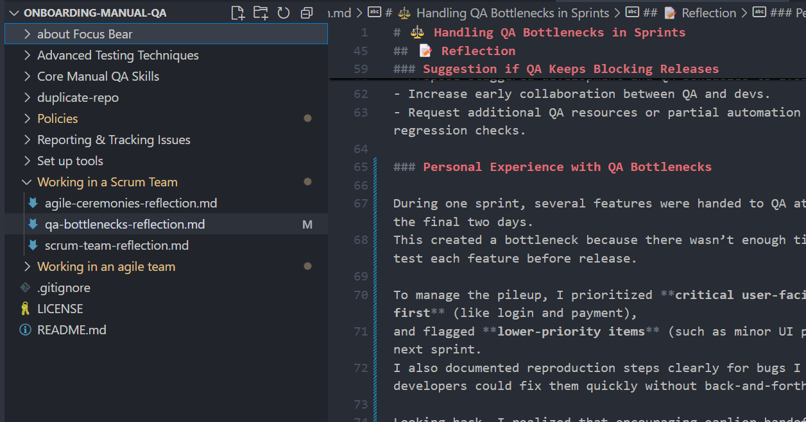

# ⚖️ Handling QA Bottlenecks in Sprints

## Role Context

Manual Q&A Intern at Focus Bear.  
My role is to ensure timely and thorough testing during Agile sprints, preventing delays caused by last-minute QA work.

---

## 🔍 Research & Learn

### Why QA Bottlenecks Happen

- Development tasks take longer than expected, pushing testing to the sprint’s end.
- Lack of QA involvement during earlier sprint stages.
- Poor task prioritization or unclear testing requirements.
- Limited QA resources compared to development output.

### Avoiding Last-Minute Testing

- Begin testing as soon as the first feature is ready, rather than waiting for all stories to be complete.
- Break down features into smaller deliverables for incremental testing.
- Maintain close communication with developers for early bug detection.

### Parallel Testing

- Testing features as they’re completed instead of waiting until development is done.
- Helps spread QA workload evenly throughout the sprint.
- Allows earlier feedback to developers, reducing last-minute fixes.

### Developer–Tester Collaboration

- Attend daily stand-ups to get real-time updates on progress.
- Pair with developers to test in staging environments before final merge.
- Share clear reproduction steps and logs quickly to unblock developers.

### Techniques for Efficient QA

- Use smoke testing to validate core functionality quickly before deep testing.
- Apply risk-based testing to focus on high-impact areas first.
- Automate repetitive checks where possible to free up time for exploratory testing.

---

## 📝 Reflection

### Prioritizing When Multiple Features Are Ready

- Test high-priority, user-facing, or high-risk features first.
- Coordinate with PMs and developers to understand business priorities.
- Defer cosmetic or low-impact issues if deadlines are tight.

### Preventing Last-Minute Rushes

- Join grooming and planning sessions to clarify testing requirements early.
- Encourage feature handoff to QA in small, testable increments.
- Maintain a visible QA backlog so the team sees pending workload.

### Suggestion if QA Keeps Blocking Releases

- Propose staggered development and QA schedules to avoid bulk handoffs.
- Increase early collaboration between QA and devs.
- Request additional QA resources or partial automation for repetitive regression checks.

### Personal Experience with QA Bottlenecks

During one sprint, several features were handed to QA at the same time on the final two days.  
This created a bottleneck because there wasn’t enough time to thoroughly test each feature before release.

To manage the pileup, I prioritized **critical user-facing features first** (like login and payment),  
and flagged **lower-priority items** (such as minor UI polish) for the next sprint.  
I also documented reproduction steps clearly for bugs I found, so developers could fix them quickly without back-and-forth.

Looking back, I realized that encouraging earlier handoffs and **testing incrementally** could have prevented the rush.  
Since then, I’ve started reminding the dev team during stand-ups to share features as soon as they’re test-ready.

