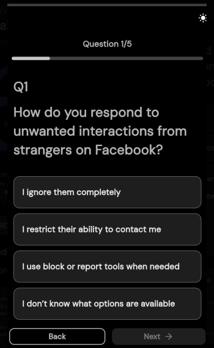
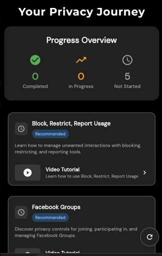

# 📅 Agile Ceremonies & Collaboration – Reflection

## Role Context

Manual Q&A Intern at Focus Bear.  
My work involves testing features, verifying fixes, and collaborating closely with the development team. Understanding Agile ceremonies helps me align my testing with development priorities and maintain smooth communication.

---

## 🔍 Research & Learn

### Main Agile Ceremonies and Their Purpose

**1. Daily Stand-ups**

- **Purpose:** A short, focused meeting (usually 15 minutes) for the team to share progress, blockers, and priorities for the day.
- **Benefit:** Keeps everyone aligned and allows quick identification of issues.

**2. Sprint Planning (Scrum) vs. Continuous Prioritization (Kanban)**

- **Sprint Planning (Scrum):** The team plans the work for the next sprint, setting clear goals and deliverables.
- **Continuous Prioritization (Kanban):** Work items are reviewed and reprioritized continuously, allowing flexibility and quick adjustments.

**3. Retrospectives**

- **Purpose:** Reflect on the last sprint or period to identify what went well, what didn’t, and how to improve.
- **Benefit:** Promotes continuous improvement and open communication.

**4. Backlog Refinement**

- **Purpose:** Review and update backlog items, clarify requirements, and ensure tasks are ready for future work.
- **Benefit:** Keeps the backlog relevant and prioritized.

---

### How Agile Teams Collaborate Asynchronously and Across Time Zones

- Use of shared Kanban boards (e.g., Jira, Trello) to track progress.
- Clear documentation in tickets and task descriptions.
- Recorded video updates or written summaries for those unable to attend live meetings.
- Asynchronous messaging via Slack or similar tools, with @mentions for urgent updates.

---

## 📝 Reflection

### How Agile Ceremonies Help with Communication and Alignment

- Ensure everyone knows current priorities and blockers.
- Provide a regular forum to raise concerns or request help.
- Create opportunities for continuous feedback and improvement.

### Most Important Ceremony for My Role

- **Daily Stand-up:**  
  As a QA intern, daily stand-ups are essential because they help me:
  - Identify which features or fixes are ready for testing.
  - Communicate any bugs or blockers immediately.
  - Stay in sync with the development timeline.

---

## 🛠️ Task Responses

**1. Attend a Stand-up Meeting and Observe Updates**

- Observed that each team member shared:
  - What they did yesterday.
  - What they plan to do today.
  - Any blockers they are facing.
- This helped me know which tasks to prioritize for testing.

**2. Participate in a Retrospective or Review Past Notes**

- Reviewed past retrospective notes and saw action items such as:
  - Reducing the number of work-in-progress items.
  - Improving task description clarity.
- These align with my QA need for well-documented testing requirements.

**3. Document One Change to Improve Team Collaboration**

- I will start adding **clear reproduction steps and screenshots** for every bug I report.  
  This will help developers quickly understand and address issues without needing multiple follow-ups.

# 🐞 Bug Report

**Title:** Progress bar not updating after initializing Quiz Module (iOS)

---

## 📋 Description

When a user starts the Quiz module in the mobile app, the **Progress Overview bar** does not update to reflect current progress on iOS devices.  
Instead, it always shows “Not Started” even after answering questions.

---

## 🔄 Steps to Reproduce

1. Open the Face book privacy awarness app on an iOS device (v1.0.0).
2. Navigate to **Your Privacy Journey → Quiz Module**.
3. Begin the first quiz (e.g., _Block, Restrict, Report Usage_).
4. Complete 1–2 questions.
5. Return to the **Progress Overview** screen.

---

## ✅ Expected Result

- Progress bar should update (e.g., “In Progress: 1” / “Completed: 1”).
- The overview should reflect the number of quizzes started/completed.

---

## ❌ Actual Result

- Progress bar remains unchanged:
  - **0 Completed**
  - **0 In Progress**
  - **5 Not Started**
- Even though a quiz session has already begun.

---

## 📸 Evidence

- Screenshot attached: shows “Not Started” despite starting a quiz.
  
  

## ⚙️ Environment

- **Device:** iPhone 13
- **OS:** iOS 17.0
- **App Version:** 1.0.0 (Beta)
- **Network:** Wi-Fi

---

## 📌 Notes

- Bug only reproduced on **iOS**.
- Works correctly on **Android** (progress updates immediately).
- Possibly related to local state not syncing with backend after initialization.
