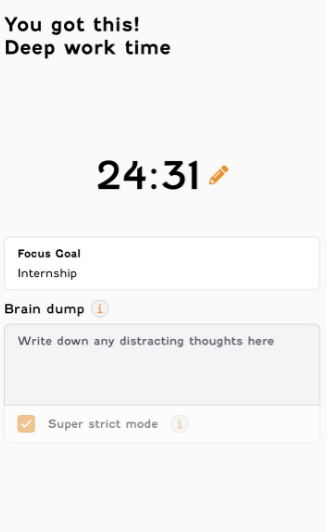
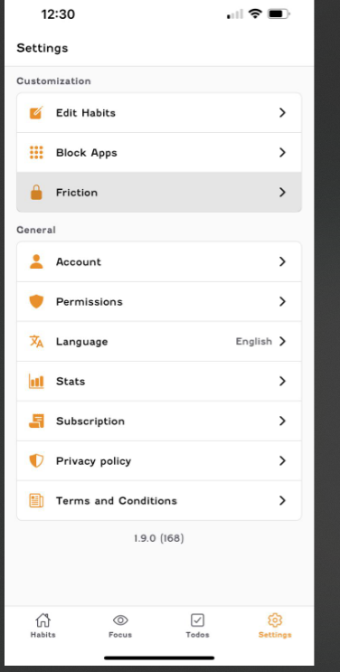
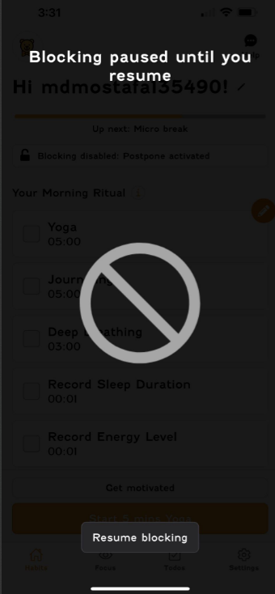
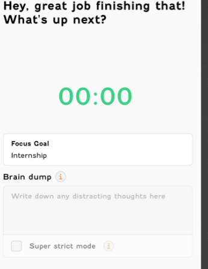
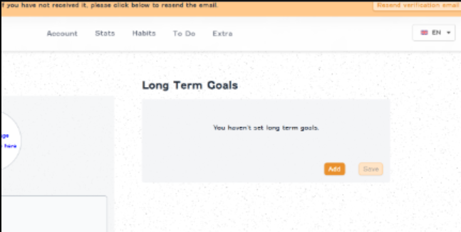

# 📱 First-Time User Experience – Focus Bear

## 📝 Observations (Friction Points)

### 1. Super Strict Mode

- **Issue:** When enabled, I was still able to access other features.
- ⚠️ This is confusing because I expected the app to fully lock distractions.
- **Screenshot:**

  

---

### 2. Friction Button Not Working

- **Issue:** Clicking **Friction** in the settings did not open any page or options.
- ⚠️ As a new user, I wasn’t sure if this was a bug or unfinished feature.
- **Screenshot:**

## 

### 3. Blocking Paused → App Unusable

- **Issue:** When I paused blocking, the app prevented me from accessing anything else.
- ⚠️ This was frustrating as I couldn’t explore features while blocking was paused.
- **Screenshot:**

---

### 4. No Alarm or Notification After Focus Session

- **Issue:** When my focus timer reached **00:00**, the app just stayed on the screen.
- ⚠️ I expected an alarm sound or vibration to notify me that time was up.
- **Screenshot:**  
  

---

### 5. Login Without Email Verification

- **Issue:** I was able to log in and use the app without verifying my email.
- ⚠️ This could cause account security and onboarding confusion.
- **Screenshot:**

  

---

## 💡 Suggestions for Improvement

1. **Add proper lock behavior for Super Strict Mode**

   - Make sure all other features are disabled until the timer ends.

2. **Improve Focus Timer End Behavior**

   - Add an **alarm sound, vibration, or push notification** when time is up.

3. **Fix or Clarify Friction Menu**

   - If it’s a bug, fix navigation. If it’s not ready, show a message like _“Coming soon.”_

4. **Allow Limited Navigation When Blocking is Paused**

   - Instead of blocking the whole app, allow users to at least explore settings or stats.

5. **Require Email Verification Before Login**
   - Improve onboarding by forcing verification before granting access.
